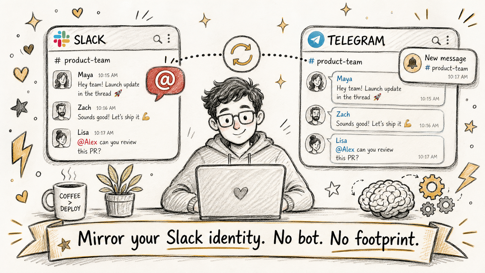

# OpenClaw Plugin: Slack Mirror 🪞



> **Mirror your Slack identity** across all workspaces — invisibly. Forward @mentions and DMs to Telegram (or WhatsApp, Discord, etc.), and post AS YOU on command. No Slack bot. No app footprint in member lists.

## Demo


The official OpenClaw Slack channel installs a visible bot user in every workspace. **This plugin doesn't.** It uses your existing browser session — the same path Slack desktop uses — so nobody else in your workspace sees a thing.

## Why this exists

OpenClaw's built-in Slack channel is great for shared team setups but breaks down for these real-life cases:

- 🤐 You're in **customer / partner Slacks** where you can't or don't want to install bots
- 👻 You want to be **pinged on phone (Telegram)** when someone @mentions you, without inviting bots into channels (and showing other members)
- ✍️ You want OpenClaw to **reply AS YOU** — not as a separate "Bot" user — so audit trails stay clean

This plugin solves all three.

## Architecture

```
┌──────────────────────────┐
│ Slack Workspace 1, 2, 3… │ ← your existing browser session (xoxc/xoxd)
└────────┬─────────────────┘
         │ RTM WebSocket (no bot)
         ▼
┌──────────────────────────┐
│ Slack Mirror Plugin      │ ← parses, filters, formats
└────────┬─────────────────┘
         │ emit synthetic message
         ▼
┌──────────────────────────┐
│ Telegram / WhatsApp /…   │ ← OpenClaw delivers via existing channel
└──────────────────────────┘

       ┌─── (optional) ────┐
       │                   │
       ▼                   │
   xoxp user OAuth ◄── posts AS user, when commanded via your notify channel
```

**Listening:** uses your `xoxc` browser session token + `d` cookie. Auto-discovers all workspaces in your `localConfig_v2`. Connects to Slack RTM WebSocket. Filters @-mentions and DMs.

**Posting (optional):** install a Slack App with user-scope OAuth in workspaces where you want to post AS yourself. Plugin uses the resulting `xoxp-` token to call `chat.postMessage` — Slack shows the message as if you typed it.

## Install

```bash
openclaw plugin add @bluedigits/openclaw-plugin-slack-mirror
```

Or manually clone into `~/.openclaw/extensions/slack-mirror/` and restart your gateway.

## Configure (one-time)

### 1. Scrape your Slack browser session

Use the included [bookmarklet](./browser-extension/README.md):
1. Add as Chrome/Firefox bookmark
2. Click on any Slack tab → your workspaces' tokens are copied to clipboard
3. Manually grab the `d` cookie from DevTools (Application → Cookies → app.slack.com)

### 2. Plugin config (in your OpenClaw config)

```json5
{
  "plugins": {
    "slack-mirror": {
      "enabled": true,
      "config": {
        "sessionConfig": "<paste the bookmarklet output JSON>",
        "dCookie": "xoxd-...",
        "notifyTarget": {
          "channel": "telegram",
          "chatId": "123456789"
        },
        "filter": {
          "includeOwnMessages": false,
          "keywordHighlights": ["urgent", "blocker"],
          "muteChannels": ["C12345NOISY"]
        },
        "posterEnabled": true,
        "userTokens": {
          "myworkspace": "xoxp-..."
        }
      }
    }
  }
}
```

### 3. Restart OpenClaw gateway

```bash
openclaw gateway restart
```

You should see in logs:
```
[slack-mirror] discovered 3 workspace(s): myworkspace, otherteam, …
[myworkspace] connected
[otherteam] connected
```

## Usage

### Receive notifications

Anyone @mentions you anywhere — within ~2 seconds, your `notifyTarget` chat gets a message:

```
🔔 Slack MyWorkspace | mention in #general
@Cody Smith: Hey @merlin can you check this?
[Open in Slack](https://...)
```

### Post AS yourself (optional, requires `posterEnabled` + `userTokens`)

In your notify channel (e.g. Telegram), tell OpenClaw what to do:

> "Reply to Cody's last message in #general with: 'on it, give me 5 min'"

OpenClaw resolves the thread, calls `chat.postMessage` with your xoxp token. Slack shows the reply from **you**, not a bot. Audit trail is clean.

## Verifying it works (without OpenClaw)

Before wiring this into your gateway, run the standalone CLI to confirm the listener actually pings your Telegram:

```bash
git clone https://github.com/merlinrabens/openclaw-plugin-slack-mirror
cd openclaw-plugin-slack-mirror
npm install && npm run build

# Option A: pass full config as JSON file
SLACK_MIRROR_CONFIG=./test-config.json TELEGRAM_BOT_TOKEN=... node dist/bin/cli.js

# Option B: read from 1Password (matches the README setup)
export OP_SERVICE_ACCOUNT_TOKEN=...
export TELEGRAM_BOT_TOKEN=<your bot token>
export TELEGRAM_CHAT_ID=<your chat id>
export OP_ITEM="Slack Browser Session — Merlin"
node dist/bin/cli.js
```

You'll see:
```
[slack-mirror] discovered 3 workspace(s): myworkspace, customer-co, side-project
[myworkspace] connected
[customer-co] connected
[side-project] connected
```

Then have someone @mention you in Slack — within ~2 seconds your Telegram should fire. Ctrl+C to stop.

Run the unit tests with:

```bash
npm test
```

## Token Refresh

Browser session tokens (xoxc/xoxd) typically last weeks-to-months. When they expire, the plugin emits an auth-failure notification:

```
⚠️ Slack Mirror auth failure for myworkspace
Browser session token expired. Re-scrape via the included bookmarklet and update plugin config.
```

Then: re-click the bookmarklet, update `sessionConfig` + `dCookie`, restart gateway. ~2 minutes.

## Security

| Token | Risk | Mitigation |
|---|---|---|
| `xoxc` / `d` cookie | Slack TOS gray area for automation. In practice, low-volume use is fine. | Listening only by default. Don't burst high-frequency calls. |
| `xoxp` user token | Acts with your full user permissions. | Optional, off by default. Only enable if you trust your OpenClaw setup. |

Both token types are concealed in OpenClaw's secret store (1Password integration recommended). Tokens never leave your machine.

## Comparison to OpenClaw's built-in Slack channel

| Feature | Built-in Slack | Slack Mirror |
|---|---|---|
| Visible bot user | ✅ yes (always) | ❌ none |
| Requires app install per workspace | ✅ yes | ❌ no (listening) / optional (posting) |
| Multi-workspace auto-discovery | ❌ manual config | ✅ via `localConfig_v2` |
| Posts AS user | ⚠️ requires xoxp + opt-in | ✅ first-class via xoxp |
| Pings only when *Slack itself would ping you* | ❌ requires bot in channels | ✅ uses real session events |
| TOS-blessed | ✅ official | ⚠️ gray area (browser session) |

**Use them together!** The built-in channel for shared team chats where a bot makes sense; this plugin for personal monitoring + AS-you posting.

## Roadmap

- [ ] First-class WhatsApp / Discord routing
- [ ] Per-channel notification rules (URGENT vs FYI)
- [ ] OAuth flow integrated into setup wizard (currently manual)
- [ ] Optional triage AI (let your agent decide what's important)
- [ ] OpenClaw Skill for inline replies via `/jerry post in #channel: ...`

## Contributing

Issues and PRs welcome at [github.com/merlinrabens/openclaw-plugin-slack-mirror](https://github.com/merlinrabens/openclaw-plugin-slack-mirror).

## License

MIT — see [LICENSE](./LICENSE).

## Acknowledgements

Inspired by tools that reverse-engineer Slack's user APIs:
- [slackdump](https://github.com/rusq/slackdump) (Go) — pioneered the xoxc/xoxd path
- OpenClaw's own [native Slack channel](https://docs.openclaw.ai/channels/slack) — for the `userToken` pattern this plugin builds on
